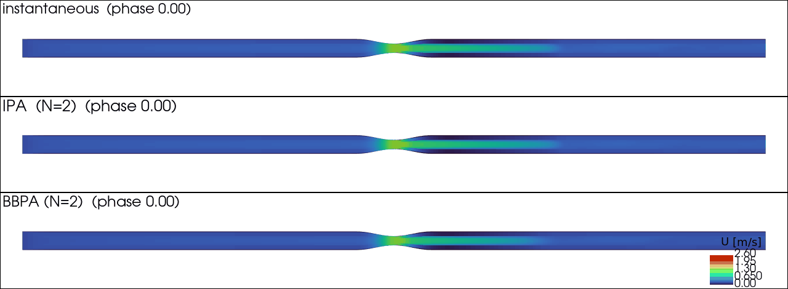

# openfoam-bbpa

**Bin-Based Phase Averaging for OpenFOAM** — an in-situ function object that
produces phase-averaged mean, cross-cycle variance, and resolved turbulent
kinetic energy directly in memory, without writing terabytes of transient
snapshots.

For the theory, error analysis, and cardiovascular LES validation see the
companion paper:

> Wang, J. *Bin-Based Phase Averaging of turbulence-resolving pulsatile flows.*
> (2026, in preparation). Paper repo:
> [`Bin-Phase-Average`](https://github.com/JieWangnk/Bin-Phase-Average)

## Features

| | BBPA | `fieldAverage` (OpenFOAM-native) | Classical offline PA |
|---|---|---|---|
| Phase-centred ensemble mean | ✅ | ✗ (causal running filter) | ✅ |
| In-situ (no snapshot I/O) | ✅ | ✅ | ✗ (terabytes of writes) |
| Raw 2nd moment `⟨UᵢUⱼ⟩` → Reynolds stress / TKE | ✅ (`_PA_UU`, reconstructed offline) | ✗ | ✅ (offline) |
| Cross-cycle variance | ✅ (Welford) | partial (`UPrime2Mean`) | ✅ |
| Wall shear stress binning | ✅ (lazy init) | ✅ | ✅ |
| Output per bin | phase-aligned time directories | single time dir | per-phase dir |
| Memory | `O(I)` per field | `O(1)` per field | n/a |
| Overhead (8.2M-cell LES, 200 cores) | **+0.67%** at I=100 (95% CI [0.2,1.1]%) | baseline | +100%+ (post-run) |

Accompanying `IPA` (Instantaneous Phase Averaging) function object samples at
exact phase crossings without binning — a zero-width limit of BBPA for
reference comparisons.

## What gets written

For each tracked vector/scalar field `φ` (e.g. `U`, `p`, `wallShearStress`),
at every solver writeTime, BBPA produces three fields in each
phase-aligned time directory `t_j = t_0 + j · (T/I)`:

| File | Contents | Units |
|---|---|---|
| `<φ>_PA` | Phase-average `⟨φ⟩_j` | same as `φ` |
| `<φ>_PAVariance` | Cross-cycle variance `M₂/(N−1)` of the bin mean | `dim(φ)²` |
| `<φ>_PA_UU` | Raw second moment `⟨φ⊗φ⟩_j` (symmetric tensor `⟨UᵢUⱼ⟩` for a vector field; `⟨φ²⟩_j` for a scalar) | `dim(φ)²` |

For a vector field, the Reynolds-stress tensor `R_ij = ⟨UᵢUⱼ⟩ − ⟨Uᵢ⟩⟨Uⱼ⟩`
and the turbulent kinetic energy `k = ½ tr(R)` are reconstructed from
`_PA_UU` and `_PA` in post-processing. (Saving the raw tensor rather than a
pre-reduced TKE keeps the full Reynolds-stress information.) At finite `I`
these are bin-conditioned quantities that approach the pointwise
phase-ensemble values as `I → ∞`. For a scalar field, `_PA_UU` reduces to
`⟨φ²⟩_j`, from which the within-bin variance `⟨φ²⟩ − ⟨φ⟩²` follows.

## Requirements

- OpenFOAM Foundation **v12** (openfoam.org)
- GCC ≥ 9, OpenMPI / equivalent

Tested on:
- Ubuntu 24.04 (system OpenFOAM 12)
- csf3 (`apps/gcc/openfoam/12`, GCC 13.3.0)
- csf4 (`openfoam/12-foss-2023a`, GCC 12.3.0)

## Build

```bash
git clone https://github.com/JieWangnk/openfoam-bbpa.git
cd openfoam-bbpa/src/phaseAveraging
wmake libso
# writes $FOAM_USER_LIBBIN/libPhaseAveraging.so
```

## Quickstart — oscillating-lid cavity tutorial

```bash
cd tutorials/oscillatingLidCavity
./Allrun
paraview case.foam &
# Time directories 0.0, 0.1, ..., 2.9 contain U_PA, p_PA, U_PA_UU, etc.
```

This 400-cell laminar case ends in ≈1 min and exercises the full pipeline:
Strategy B phase-aligned output, Welford variance, second-moment accumulator.

## Quickstart — stenosis-pipe tutorial

A reduced version of the paper's §3 same-trajectory validation case: a
`D = 5` mm pipe with a cosine-tapered 75 % area constriction at the midpoint,
driven by a sinusoidal inlet `U = 0.3 + 0.3 sin(2πt)` (period `T = 1` s),
WALE LES. The mesh is coarsened to ≈18 k cells and the run is 3 forcing
periods, so it completes in ~30 min on 4 cores (the paper used a 256 k-cell
mesh over 50 cycles).



*Mid-plane `|U|` over the cardiac phase. Top: instantaneous (one realisation —
the post-throat shear-layer jet meanders). Middle: classical pointwise IPA.
Bottom: BBPA. IPA and BBPA are phase-averaged over the two accumulated cycles
and are visibly smoother than the single instantaneous realisation.*

```bash
cd tutorials/stenosisPipe
./Allrun                       # blockMesh -> decomposePar -> foamRun (4 cores) -> reconstructPar
paraview case.foam &
```

The case runs **BBPA and IPA on the same trajectory**. BBPA uses `writeMode
companion`, so each time directory holds the instantaneous `U` **and** that
phase's bin `U_PA` (+ `U_PA_UU`, `U_PAVariance`) together, and the output
reconstructs cleanly in parallel. From `U_PA_UU` and `U_PA` you get the Reynolds
stress `R_ij = U_PA_UU - U_PA⊗U_PA` and TKE `= ½ tr(R)`. IPA writes its 50 phase
fields `U_IPA_phase{0..49}` at the cycle ends. Both use `period 1.0`,
`nBins`/`nPhases 50`, `startCycle 1` (first forcing period discarded as the
start-up transient).

Build the 3-panel phase animation above from the finished case with:

```bash
python3 ../../scripts/make_phase_animation.py .   # needs pyvista + imageio
```

Edit `system/decomposeParDict` to change the core count, or set
`numberOfSubdomains 1` and replace the parallel lines in `Allrun` with
`runApplication $(getApplication)` to run serially (then BBPA's
`phaseAlignedDirs` mode also works without the per-processor nesting).

## Usage in your own case

In `system/controlDict`:

```c
libs ("libPhaseAveraging.so");

functions
{
    #includeFunc wallShearStress    // if tracking WSS: list BEFORE bbpa

    bbpa
    {
        type            BBPA;
        libs            ("libPhaseAveraging.so");
        executeControl  timeStep;
        executeInterval 1;
        writeControl    writeTime;       // fire on solver writeTimes
        fields          (U p wallShearStress);
        period          1.0;             // cardiac cycle (s)
        nBins           50;              // I
        startCycle      2;               // skip transient
    }
}
```

Optional keys:
- `startTime <s>` — explicit phase origin; defaults to `floor(t/period)*period`
- `cycles <N>` — stop averaging after N cycles; defaults to unlimited

See `src/phaseAveraging/exampleDict_BBPA` and `exampleDict_IPA` for full
dictionaries.

## Scripts

| `scripts/bench_overhead.py` | Parse matched-pair logs (with/without BBPA) and report per-step walltime + overhead % |
| `scripts/screenshot_WSS_BPM120.py` | pvbatch renderer for WSS-filter-width 3-panel figure (paper Fig. X) |

## Implementation notes

- **Welford M₂** for cross-cycle variance — numerically stable; avoids catastrophic cancellation when cycle-to-cycle differences are small.
- **Lazy field lookup**: the field list is re-checked every `execute()`, so fields registered by other function objects (e.g. `wallShearStress`) are picked up even if BBPA is constructed before them.
- **Strategy B output**: each bin writes to its own phase-aligned time directory, so `foamListTimes` / `foamToVTK` handle the output natively without special postprocessing.
- **Partial-cycle second moment**: `_PA_UU` fires even on a single-cycle run (`binCounts_ == 0`) by falling through to the in-progress accumulators — eliminates endpoint-alignment gotchas.

## License

GPL-3.0 (same as OpenFOAM). See `LICENSE`.

## Citation

If you use BBPA in your work, please cite the paper:

```bibtex
@article{wang2026bbpa,
  author = {Wang, Jie},
  title  = {Bin-Based Phase Averaging of turbulence-resolving pulsatile flows},
  year   = {2026},
  note   = {in preparation}
}
```
